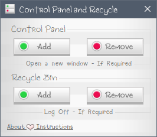

# Control Panel and Recycle
Allows to put the Control Panel and the Recycle Bin in the Navigation Pane *(Only compatible with Windows 10).*

# Project Instructions:
The **•Program Files** directory refers to **"C:\Program Files"** and indicates the folders and files that should be inside, since
by default the program looks for and generates files on that path.

The **•Fonts** directory contains all the fonts that should be installed before, because by default, the program uses those fonts
(also refers to **"C:\Windows\Fonts"**).

Everything else is as you normally know it. ♥

# How does it work
There are two sections **Control Panel** and **Recycle Bin**, choose the one you want and simply press **Add** or **Remove** and wait
until the button returns to normality. If required, you follow the steps indicated below the buttons **(Open a new window or
Log Off - but you can Restart too)** to see the changes.

**REMEMBER:** You must be an administrator user because you will make changes to your system. ♥

# License
**ISC License (ISC)** - You can read the full license at < *•Program Files/Control Panel and Recycle/About/License.txt* >
(It's really the best I've come across, I hope it's easy for you to understand.)